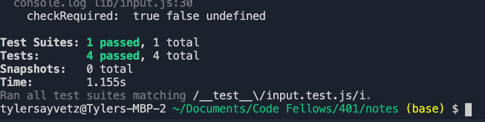

# LAB - Class xx

## Project Name
Notes

### Author: Student/Group Name
Tyler Sayvetz

### Links and Resources

- [submission PR]https://github.com/tyler-401-advanced-javascript/notes/pull/1
- [ci/cd] https://travis-ci.com/tyler-401-advanced-javascript/notes/builds/148321541 (GitHub Actions)

- this is a CLI, no deployment.

### Setup
Clone the repo.
npm i
node index.js -a 'some note'

#### Tests

- Tests are located in __test__ directory. 
- npm test __test__/input.test.js

tests failing on Travis, passing locally. 

#### UML
;
