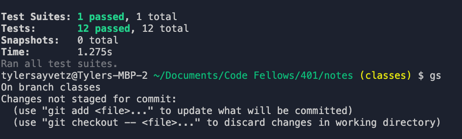

# LAB - Class 02

## Project Name

Notes CLI program!

### Author:

Tyler Sayvetz

### Links and Resources

- [submission PR] https://github.com/tyler-401-advanced-javascript/notes/pull/2
- [ci/cd] None.

- this is a CLI, no deployment.

### Setup
Clone the repo.

npm i

node index.js -a 'tasty beverage'

#### Tests

- Tests are located in __test__ directory. 

- npm test __test__/input.test.js

#### UML

